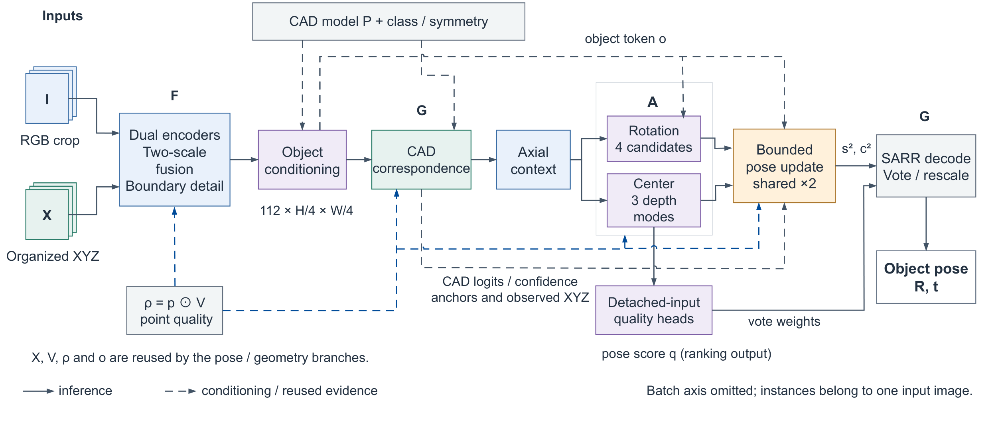

# RVC6D: Reliability-Aware Visible-Surface Correspondence for Real-Time RGB-D 6D Pose Estimation

RVC6D is a compact RGB-D 6D object pose estimator organized into three
functional groups: reliability-aware RGB-XYZ feature organization (**F**),
ambiguity-preserving multi-hypothesis pose heads (**A**), and visible-surface
CAD correspondence with bounded residual refinement (**G**).
The full model uses **2.45M parameters** and **4.05 GFLOPs per 128x128 crop** (torch profiler).

This repository is the clean release: one training entry point, one
end-to-end detection-track evaluation entry point, and the released weights.

## Overview

[](assets/overview.pdf)

**RVC6D** takes an aligned RGB crop and organized XYZ coordinates, together
with a class-specific CAD model, and predicts the object pose (R, t) in the
camera frame. Processing follows three functional groups:

- **F — reliability-aware RGB-XYZ feature organization.** Dual encoders with
  two-scale cross-modal fusion conditioned on depth validity and per-point
  reliability, followed by boundary-detail refinement.
- **A — ambiguity-preserving pose heads.** Class-conditioned object token;
  four rotation candidates and three depth modes are kept before committing
  to a solution.
- **G — visible-surface correspondence with bounded refinement.** Image
  evidence is compressed onto fixed CAD anchors and consumed by two bounded
  residual updates that reuse the correspondence evidence.

Dense vote weights aggregate translations and object-level quality scores
rank candidate boxes; the SARR decoder outputs the final pose. Validity (V),
point reliability (rho), and the object token are reused across the pose and
geometry branches, as indicated by the dashed arrows in the figure.

## Released checkpoints (`checkpoints/`)

| File | Dataset | Description |
|---|---|---|
| `rvc6d_tless_e39.pth.tar` | T-LESS | Epoch-39 EMA weights, BOP19 test protocol |
| `rvc6d_lmo_e36.pth.tar` | LM-O | Epoch-36 EMA weights, BOP19 test protocol |

## Installation

```bash
conda create -n rvc6d python=3.11 -y
conda activate rvc6d
pip install -r requirements.txt   # installs torch 2.8.0+cu128 and all deps
```

The requirements file pins the CUDA-12.8 PyTorch build the weights were
validated with (~7 GB installed; add `--no-cache-dir` on tight disks).
To use a different CUDA build, replace the two `torch`/`torchvision`
lines with the wheels matching your driver.

## Data layout

Download the BOP datasets ([bop.felk.cvut.cz/datasets/]) and place them
BOP-standard layout. Only the test splits are required for evaluation;
training on T-LESS additionally uses `train_pbr` (+ optional real `train_primesense`),
training on LM-O uses `train_pbr` (+ real `train`).

```
data/tless/                     # or set TLESS_ROOT
├── test_primesense/000000/     # rgb/ depth/ mask_visib/ scene_gt.json scene_gt_info.json scene_camera.json
├── train_pbr/...               # training only (BOP T-LESS train_pbr)
├── train_primesense/...        # optional real split for training
├── models_eval/  (or model_eval/)   # obj_XXXXXX.ply + models_info.json
├── classes.txt                 # one BOP object id per line, ascending
├── test_targets_bop19.json
└── tless_gp.json               # (optional) GADD primitives, bundled in datasets/tless/

data/lmo/                       # or set LMO_ROOT
├── test/000002/...
├── train_pbr/...               # training only (BOP LM-O train_pbr)
├── train/...                   # training only (real split)
├── models_eval/  (or model_eval/)
├── classes.txt                 # 8 BOP ids: 1 5 6 8 9 10 11 12
└── test_targets_bop19.json
```

Notes:
- `classes.txt` must list object ids in **ascending** order; LM-O network class
  slots are the contiguous mapping `{1:1, 5:2, 6:3, 8:4, 9:5, 10:6, 11:7, 12:8}`.
- For LM-O the SARR symmetry table is switched automatically by
  `--dataset lmo` (and by the evaluation tool).

## End-to-end evaluation (DefaultDetections)

Run pose estimation on external detector boxes and produce a BOP19 CSV:

```bash
python tools/evaluate_bop_detections.py \
  --dataset tless \
  --dataset_root data/tless \
  --checkpoint checkpoints/rvc6d_tless_e39.pth.tar \
  --detections /path/to/detections_tless.json \
  --method rvc6d
```

- `--detections` accepts the BOP DefaultDetections format (flat list of
  `{scene_id, image_id, category_id, bbox, score, time}`) or an image-keyed
  detector export (`{"scene/im": [{"bbox_est": [...], "obj_id": ..., ...}]}`).
- Output: `evaluation/rvc6d_tless-test.csv` (+ `*_report.json` with timing
  and coverage). CSV `time` = detector time from the JSON plus the measured
  synchronized forward+decode time per image (BOP detector+pose convention).
- Score the CSV with the official [bop_toolkit] `eval_bop19_pose.py`.
- LM-O: replace `--dataset lmo --dataset_root data/lmo --checkpoint
  checkpoints/rvc6d_lmo_e36.pth.tar`.
- Useful flags: `--score_mode det_x_pose|pose|det`, `--max_images N`
  (smoke runs), `--warmup_images 0`, `--csv-time-mode pose_only`
  (report the bare pose-pipeline time in the CSV).
- The tool runs the optimized release pipeline: per-image CPU
  preprocessing (bitwise-identical to the dataset path), one batch per
  image with a CUDA Graph per observed batch size, and fused batched
  decode (~5.7 ms/image pose stage on an RTX 5090; graphs fall back to
  eager automatically if capture fails). Validate the preprocessing on
  a new setup with `--verify 3` (bitwise comparison, off by default).

For T-LESS the paper uses the YOLOX-based DefaultDetections with
`--proposal_factor 1` (top-1 box per target), which reproduces the reported
detection-track result.

## Training

```bash
# T-LESS (PBR + real mixed sampling)
python train.py --dataset tless --experiment release_run \
  --train_splits train_pbr train_primesense --real_sampling_ratio 0.05

# LM-O (PBR + real mixed sampling)
python train.py --dataset lmo --experiment release_run \
  --train_splits train_pbr train --real_sampling_ratio 0.05
```

- Validation runs on the official test split every `--test_every` epochs and
  selects `checkpoint_best.pth.tar` by `--selection_metric add_auc` (EMA
  weights when `--use_ema true`, the default).
- No intermediate submission CSV is written during training; produce the
  official submission with `tools/evaluate_bop_detections.py` after training.
- On servers with many dataloader workers, raise the open-file limit first:
  `ulimit -n 65535`.

## Repository layout

```
train.py                      training + internal validation
tools/evaluate_bop_detections.py  end-to-end detection-track BOP19 evaluation
datasets/tless/               PoseDataset (T-LESS / LM-O, bbox-driven crops)
models/                       RVC6D (F/A/G groups)
lib/                          SARR, point reliability filter, refinement, AUC
checkpoints/                  released T-LESS / LM-O weights
```

## Code availability

The code, released weights, and evaluation results are archived on Zenodo
(DOI [10.5281/zenodo.22726061](https://doi.org/10.5281/zenodo.22726061)).

## License

Released under the MIT License (see `LICENSE`) for double-blind review;
the author list is anonymized and will be replaced upon acceptance.
`lib/transformations.py` contains third-party code by Christoph Gohlke
(BSD 3-Clause); its original notice is retained in the file header.
